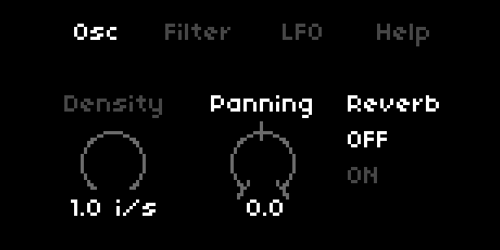
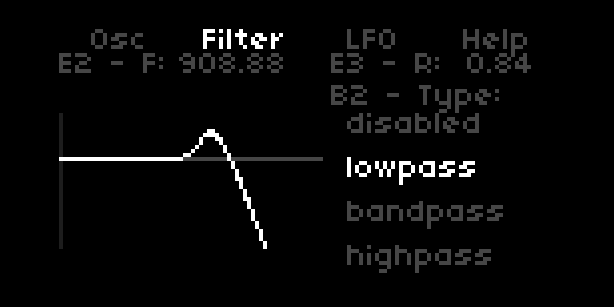
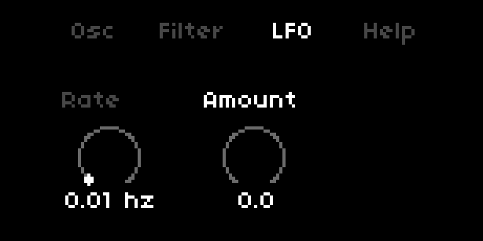
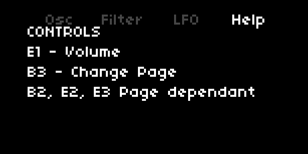

# Speckles

Part of illusory discontinuity

## Guide

### General Controls

In speckles there are generic controls; these have the same functionality across the different screens

* Encoder 1 changes the overall Volume
* Button 1 has the standard norns function of toggling between speckles and the main menu
* Button 3 changes the active screen

Button 2, Encoder 2 and Encoder 3 are screen dependant

### Screen 1 - Osc

This is the Osc screen, where one can control the Engine's sound maker.  
**Encoder 2** will handle the speckles density, **Encoder 3** will handle the panning and **Button 2** toggles the Reverb *on* and *off*

**NB** *the Reverb is the main norns Reverb, not an engine specific one*

### Screen 2 - Filter

The filter screen we can control the engine's filtering; there are four options available to us:

* disabled (default)
* lowpass
* bandpass
* highpass

**Button 2** will allow switching active filter  
Using **Encoder 2** the filter frequency can be changed and **Encoder 3** will change the filter's resonance

### Screen 3 - LFO

The LFO screen allows us to control a random stepped LFO that will impact the panning

Using **Encoder 2** we control the LFO rate and **Encoder 3** controls the amount applied to the panning. This will be centered around the current panning value (defined in screen 1).
Also of note is that panning (standard value + the LFO) will be clipped between **-1** and **1**

### Screen 4 - Help

This is a generic help screen
